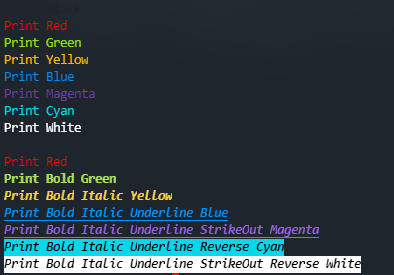

# color_print

Example



```python
from colorful_print import color

color.black('Print Black')
color.red('Print Red')
color.green('Print Green')
color.yellow('Print Yellow')
color.blue('Print Blue')
color.magenta('Print Magenta')
color.cyan('Print Cyan')
color.white('Print White')

print()
color.red('Print Red')
color.green('Print Bold Green', bold = True)
color.yellow('Print Bold Italic Yellow', bold = True, italic = True)
color.blue('Print Bold Italic Underline Blue', bold = True, italic = True, underline = True)
color.magenta('Print Bold Italic Underline StrikeOut Magenta', bold = True, italic = True, underline = True, strike_out = True)
color.cyan('Print Bold Italic Underline Reverse Cyan', bold = True, italic = True, underline = True, reverse = True)
color.white('Print Bold Italic Underline StrikeOut Reverse White', bold = True, italic = True, underline = True, strike_out = True, reverse = True)
```

Usage
```shell script
pip install colorful_print
```