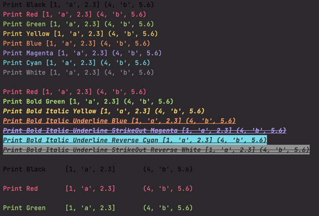

# Color Print

[](https://badge.fury.io/py/colorful_print)
[](https://pypi.python.org/pypi/colorful_print)
[](https://www.codefactor.io/repository/github/sanggi-wjg/color_print)
[](https://pypi.org/project/colorful-print/)





## Install
```shell script
pip install colorful_print
```


## Usage 1
```python
import sys
from colorful_print import color

a = [1, 'a', 2.3]
b = (4, 'b', 5.6)

color.black('Print Black', a, b)
color.red('Print Red', a, b)
color.green('Print Green', a, b)
color.yellow('Print Yellow', a, b)
color.blue('Print Blue', a, b)
color.magenta('Print Magenta', a, b)
color.cyan('Print Cyan', a, b)
color.white('Print White', a, b)
sys.stdout.write("\n")

color.red('Print Red', a, b)
color.green('Print Bold Green', a, b, bold=True)
color.yellow('Print Bold Italic Yellow', a, b, bold=True, italic=True)
color.blue('Print Bold Italic Underline Blue', a, b, bold=True, italic=True, underline=True)
color.magenta('Print Bold Italic Underline StrikeOut Magenta', a, b, bold=True, italic=True, underline=True, strike_out=True)
color.cyan('Print Bold Italic Underline Reverse Cyan', a, b, bold=True, italic=True, underline=True, reverse=True)
color.white('Print Bold Italic Underline StrikeOut Reverse White', a, b, bold=True, italic=True, underline=True, strike_out=True, reverse=True)
sys.stdout.write("\n")

color.black('Print Black', a, b, sep='\t\t', end='\n\n', flush=True)
color.red('Print Red', a, b, sep='\t\t', end='\n\n', flush=True)
color.green('Print Green', a, b, sep='\t\t', end='\n\n', flush=True)
```


## Usage 2
```python
from colorful_print import color

def colorful_dispatcher(c: str, msg: str, *args, **kwargs):
    dispatch = getattr(color, c)
    dispatch(msg, *args, **kwargs)

def red(msg: str, *args, **kwargs):
    colorful_dispatcher('red', msg, *args, **kwargs)

def yellow(msg: str, *args, **kwargs):
    colorful_dispatcher('yellow', msg, *args, **kwargs)

red('123', 456, italic=True)
yellow('789', 123.456, italic=True, bold=True)
```


